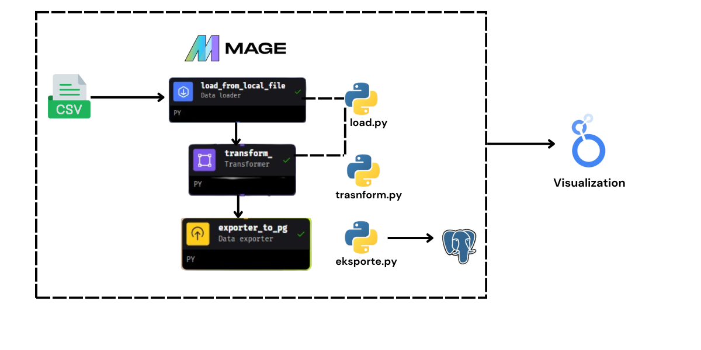
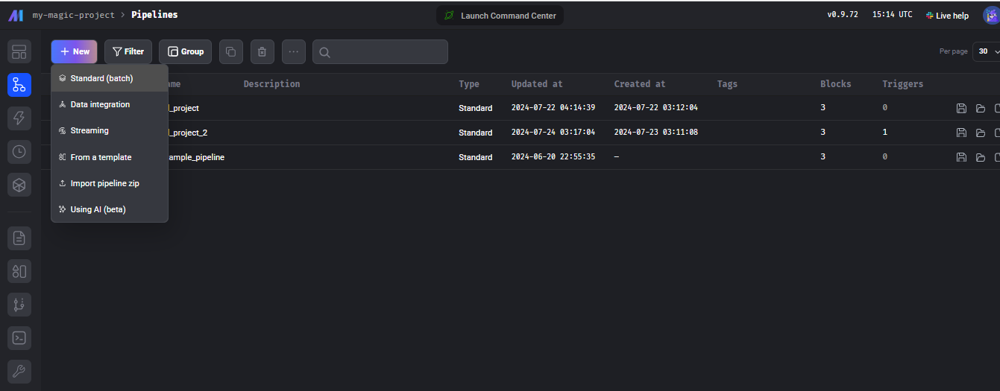
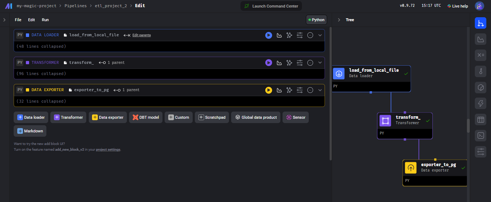

# mage-project-etl
This project is a test project given by PT Modular Kuliner Indonesia (hangry!) during the recruitment process. This project uses mage.ai as orchestration.

## Problem Statement
This project is designed to provide valuable sales insights that drive business growth and progress. I extract data from Google Spreadsheet and perform ETL (Extract, Transform, Load) operations using Mage. The transformed data is then exported to PostgreSQL, allowing for advanced analysis and visualization in Google Looker Studio. Through this streamlined process, I aim to uncover actionable insights that can significantly impact business strategies.

## Tech stack Used:
1. Python
2. SQL
3. Docker
4. Mage -AI for orchestration
5. Looker Studio

## Data Pipeline Design
This data pipeline uses the ETL concept with Mage.ai


## Setup Mage.ai With Docker compose
Now, let's build the container
```
docker compose build
```
To finish, start up the Docker container:
```
docker compose up
```
Next, open your browser and go to http://localhost:6789. You're all set to begin the course.

## Create Data Pipeline
Once you open the Mage UI, you can quickly create a Data Pipeline for either Batch or Streaming data processing.


Once the data pipeline is established, you can define various processes and stages. In this project, I set up three key components: Data Loader, Transformer, and Data Exporter.

Here is the code I use to load the data loader.
```
from mage_ai.io.file import FileIO
if 'data_loader' not in globals():
    from mage_ai.data_preparation.decorators import data_loader
if 'test' not in globals():
    from mage_ai.data_preparation.decorators import test


@data_loader
def load_data_from_file(*args, **kwargs):
    """
    Template for loading data from filesystem.
    Load data from 1 file or multiple file directories.

    For multiple directories, use the following:
        FileIO().load(file_directories=['dir_1', 'dir_2'])

    Docs: /design/data-loading#fileio
    """
    filepaths = [
        '/home/src/data/menu.csv',
        '/home/src/data/orders.csv',
        '/home/src/data/promotions.csv'
    ]

    # Load each dataset and store them in a dictionary
    datasets = {
        'df_menu': FileIO().load(filepaths[0]),
        'df_orders': FileIO().load(filepaths[1]),
        'df_promotions': FileIO().load(filepaths[2])
    }

    return datasets


@test
def test_output(output, *args) -> None:
    """
    Template code for testing the output of the block.
    """
    assert output is not None, 'The output is undefined'
    assert isinstance(output, dict), 'The output should be a dictionary'
    assert 'df_menu' in output, 'df_menu table is missing'
    assert 'df_orders' in output, 'df_orders table is missing'
    assert 'df_promotions' in output, 'df_promotions table is missing'
    assert not output['df_menu'].empty, 'The df_menu table is empty'
    assert not output['df_orders'].empty, 'The df_orders table is empty'
    assert not output['df_promotions'].empty, 'The df_promotions table is empty'

```

Here is the code I use for the transformer in Mage.

```
import pandas as pd

# Transformer block

if 'transformer' not in globals():
    from mage_ai.data_preparation.decorators import transformer

@transformer
def transform(data, *args, **kwargs):
    """
    Template code for a transformer block.

    Add more parameters to this function if this block has multiple parent blocks.
    There should be one parameter for each output variable from each parent block.

    Args:
        data: The output from the upstream parent block
        args: The output from any additional upstream blocks (if applicable)

    Returns:
        Anything (e.g. data frame, dictionary, array, int, str, etc.)
    """
    df_menu = data['df_menu']
    df_orders = data['df_orders']
    df_promotions = data['df_promotions']
    
    # Change data type
    df_menu['effective_date'] = pd.to_datetime(df_menu['effective_date'], format="%Y-%m-%d")
    df_orders['sales_date'] = pd.to_datetime(df_orders['sales_date'], format="%Y/%m/%d")
    df_promotions['start_date'] = pd.to_datetime(df_promotions['start_date'], format="%Y-%m-%d")
    df_promotions['end_date'] = pd.to_datetime(df_promotions['end_date'], format="%Y-%m-%d")

    # identify order_id that has more than one sales_date
    order_sales_date_counts = df_orders.groupby(['order_id', 'sales_date']).size().reset_index(name='counts')
    order_max_sales_date = order_sales_date_counts.loc[order_sales_date_counts.groupby('order_id')['counts'].idxmax()]

    # Recombine to ensure each order_id has the same sales_date
    df_orders = pd.merge(df_orders.drop('sales_date', axis=1), order_max_sales_date[['order_id', 'sales_date']], on='order_id', how='left')

    # Drop duplicate
    df_orders = df_orders.drop_duplicates(inplace=False)


    # Combining df_orders and df_menu based on 'menu_id'
    df_merged = pd.merge(df_orders, df_menu, on='menu_id', how='left')

    # Determines price based on effective_date
    df_merged = df_merged[df_merged['sales_date'] >= df_merged['effective_date']]

    # Retrieve the latest price based on effective_date
    df_merged = df_merged.loc[df_merged.groupby(['order_id', 'menu_id'])['effective_date'].idxmax()]

    # Merge the results with df_orders to ensure all rows are present
    df_merged = pd.merge(df_orders, df_merged[['order_id', 'menu_id', 'effective_date', 'name', 'price', 'cogs']], on=['order_id', 'menu_id'], how='left')

    # Removed unnecessary columns
    df_merged = df_merged[['order_id', 'sales_date', 'menu_id', 'name', 'quantity', 'price', 'cogs']]

    # Create an active_date column in df_promotions based on the start_date and end_date range
    df_active_dates = pd.DataFrame()

    for _, row in df_promotions.iterrows():
        temp_df = pd.DataFrame({
            'id': row['id'],
            'active_date': pd.date_range(start=row['start_date'], end=row['end_date'])
            })
        df_active_dates = pd.concat([df_active_dates, temp_df])

    # Merge df_active_dates with df_promotions to get disc_value and max_disc columns
    df_active_dates = pd.merge(df_active_dates, df_promotions, on='id')

    # Merge df_merged with df_active_dates based on sales_date and active_date
    df_final = pd.merge(df_merged, df_active_dates, left_on='sales_date', right_on='active_date', how='left')

    # Fills disc_value and max_disc values ​​that do not correspond to 0
    df_final['disc_value'] = df_final['disc_value'].fillna(0)
    df_final['max_disc'] = df_final['max_disc'].fillna(0)

    # Removed unnecessary columns
    df_final = df_final[['order_id', 'sales_date', 'menu_id', 'name', 'quantity', 'price', 'cogs', 'disc_value', 'max_disc']]


    return df_final


@test
def test_output(output, *args) -> None:
    """
    Template code for testing the output of the block.
    """
    assert output is not None, 'The output is undefined'
    assert isinstance(output, pd.DataFrame), 'The output should be a DataFrame'
    assert not output.empty, 'The output DataFrame is empty'
```
Here is the code I use for exporting data to PostgreSQL.
```
from mage_ai.settings.repo import get_repo_path
from mage_ai.io.config import ConfigFileLoader
from mage_ai.io.postgres import Postgres
from pandas import DataFrame
from os import path

if 'data_exporter' not in globals():
    from mage_ai.data_preparation.decorators import data_exporter


@data_exporter
def export_data_to_postgres(df: DataFrame, **kwargs) -> None:
    """
    Template for exporting data to a PostgreSQL database.
    Specify your configuration settings in 'io_config.yaml'.

    Docs: https://docs.mage.ai/design/data-loading#postgresql
    """
    schema_name = 'merchant'  # Specify the name of the schema to export data to
    table_name = 'dm_resto'  # Specify the name of the table to export data to
    config_path = path.join(get_repo_path(), 'io_config.yaml')
    config_profile = 'default'

    with Postgres.with_config(ConfigFileLoader(config_path, config_profile)) as loader:
        loader.export(
            df,
            schema_name,
            table_name,
            index=False,  # Specifies whether to include index in exported table
            if_exists='replace',  # Specify resolution policy if table name already exists
        )

```

## Manage Data in Postgre
Create a query to add the required columns after loading the data into PostgreSQL.
```
WITH aggregated_data AS (
    SELECT 
        order_id, 
        sales_date, 
        SUM(quantity * price) AS total_amount,
        SUM(quantity * cogs) AS total_cogs,
        AVG(disc_value) AS avg_disc_value,
        AVG(max_disc) AS avg_max_disc       
    FROM dm_resto dr
    GROUP BY order_id, sales_date
),
discounted_data AS (
    SELECT
        order_id,
        sales_date,
        total_amount,
        total_cogs,
        avg_disc_value AS disc_value,
        avg_max_disc AS max_disc,
        LEAST(total_amount * avg_disc_value, avg_max_disc) AS total_discount_applied
    FROM aggregated_data
)
SELECT
    order_id,
    sales_date,
    total_amount,
    total_cogs,
    disc_value,
    max_disc,
    total_discount_applied,
    total_amount - total_discount_applied - total_cogs AS net_profit
FROM discounted_data
ORDER BY order_id ASC;

```


## Sales Report
visualization created using looker studio. you can see it [here](https://lookerstudio.google.com/reporting/8cd12d77-9892-4b36-8f08-4ff0ccbf4e09).
