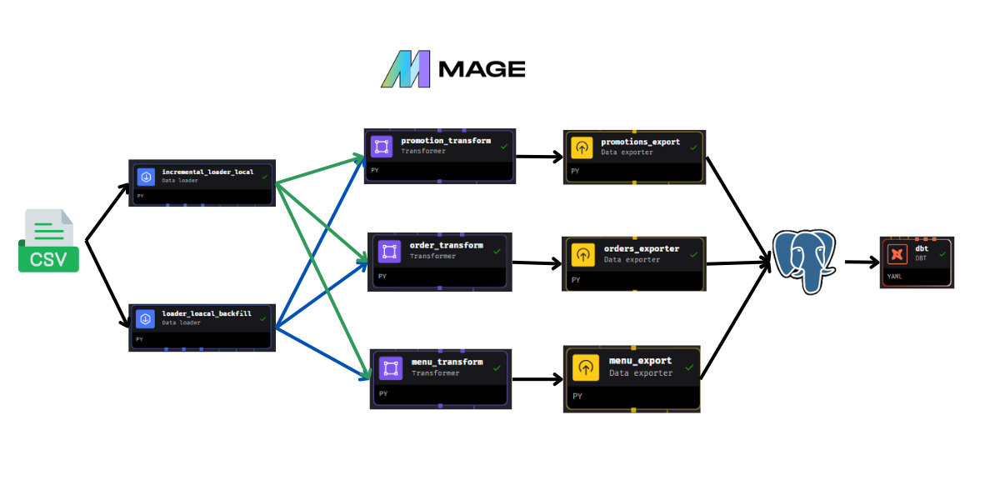
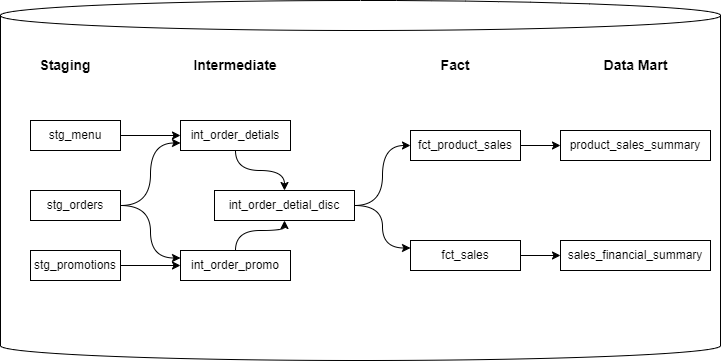
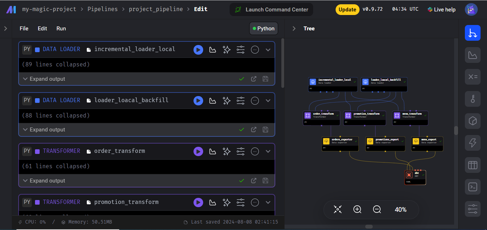

# mage-project-etl

## Problem Statement
This project is designed to provide valuable sales insights that drive business growth and progress. I extract data from Google Spreadsheet and perform ETL (Extract, Transform, Load) operations using Mage. The transformed data is then exported to PostgreSQL, allowing for advanced analysis and visualization in Google Looker Studio. Through this streamlined process, I aim to uncover actionable insights that can significantly impact business strategies.

## Tech stack Used:
1. Python
2. SQL
3. Docker
4. Mage -AI for orchestration
5. Looker Studio

## Data Pipeline Design
This data pipeline design was created with Mage.ai.


## Data Warehouse
Data warehouse model created using dbt.

## Setup Mage.ai With Docker compose
Now, let's build the container
```
docker compose build
```
To finish, start up the Docker container:
```
docker compose up
```
Next, open your browser and go to http://localhost:6789. You're all set to begin the course.

## Create Data Pipeline
Once you open the Mage UI, you can quickly create a Data Pipeline for either Batch or Streaming data processing.


Once the data pipeline is established, you can define various processes and stages. In this project, I set up three key components: Data Loader, Transformer, and Data Exporter.



## Sales Report
visualization created using looker studio. you can see it [here](https://lookerstudio.google.com/reporting/8cd12d77-9892-4b36-8f08-4ff0ccbf4e09).
